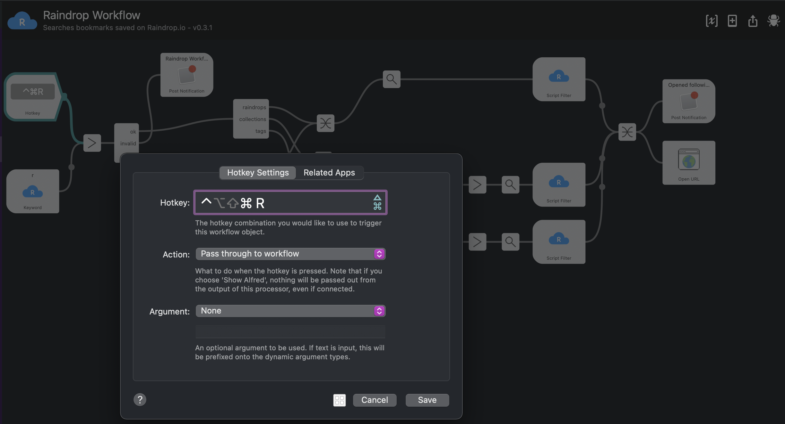

# Raindrop Alfred Workflow

Alfred workflow to see bookmarks stored on [Raindrop.io](https://raindrop.io/).

This workflow utilizes [Raindrop.io API](https://developer.raindrop.io).

## How to use

### Import workflow

Download a latest package from [release page](https://github.com/ytakahashi/raindrop-alfred-workflow/releases) and import it (ref. [Importing and Setting Up Alfred Workflows](https://www.alfredapp.com/blog/tips-and-tricks/tutorial-importing-and-setting-up-alfred-workflows/)).

You can see two configurable (`accessToken` and `target`) variables as below:

To use this workflow, `accessToken` is required to access [Raindrop.io API](https://developer.raindrop.io).

You can obtain your access token to follow [this document](https://developer.raindrop.io/v1/authentication/token). I recommend to use test token because this workflow does not access any data except your account.

`target` is an optional variable (see [below](#configure-list-target)).

### Set up workflow

This workflow contains [hotkey](https://www.alfredapp.com/help/workflows/triggers/hotkey), but hotkeys are stripped out when you import the workflow.  
You can set by double-clicking the hotkey object (upper left object).  

Trigger the hotkey you set or type `r` into Alfred to invoke this workflow.

`Raindrops` calls [Get raindrops API](https://developer.raindrop.io/v1/raindrops/multiple#get-raindrops). Returns max 50 items in descending order of created date.

`Collections` calls [Get root collections API](https://developer.raindrop.io/v1/collections/methods#get-root-collections).

`Tags` calls [Get tags API](https://developer.raindrop.io/v1/tags#get-tags).

### Configure list target

By configuring `target` variable, you can skip selecting Raindrops/Collections/Tags.  
Note that `target` should be one of `raindrops`/`collections`/`tags`.
